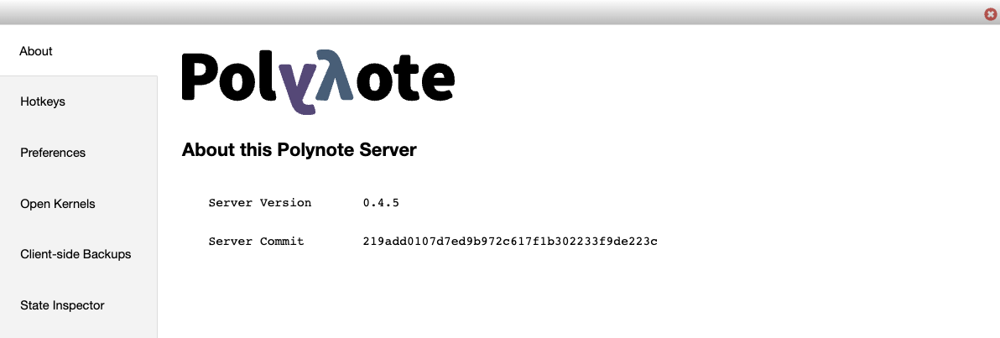

The about menu provides a deeper view into your instance of Polynote. 

The left pane contains several sections to view different pieces of data about Polynote. 

### About 
The about menu contains information about your instance's version and most recent server commit. 

### Hotkeys 
The hotkeys menu contains a list of all supported keyboard shortcuts in Polynote. 

### Preferences 
The preferences menu contains two sections - _UI preferences_ and _storage_.

#### UI Preferences 
The preferences menu is where you can customize the following settings: 

- **vim**: Whether VIM input mode is enabled for code cells 
- **theme**: Light or Dark application color scheme 
- **notifications**: Whether Polynote can send you browser notifications. 

#### Storage 
The storage menu displays key-value pairs of all the data Polynote it storing in your browser's local storage, 
and provides easy access to wipe that data. 

### Open Kernels 
The open kernels menu contains a list of all existing kernels for existing notebooks. You can view their path, 
status (idle, running, or dead), and start/kill/jump to all of these kernels. 

### Client-side Backups 
The client-side backups menu contains a list of all the client-side backups that Polynote occasionally creates of your 
notebooks and stores in your browser. 

These backups are intended to be used as a last resort, in case something happened to the physical files on disk. 
This is not intended to replace a proper version history feature which may be implemented in the future. 
Your browser may chose to delete these backups at any time!

You can also print these backups to your console for easy JSON formatting, or clear all previous backups. 

### State Inspector 
The state inspector menu shows the current state of the server, as well as each notebook you have. This is mostly useful 
for debugging purposes and reporting errors. 
