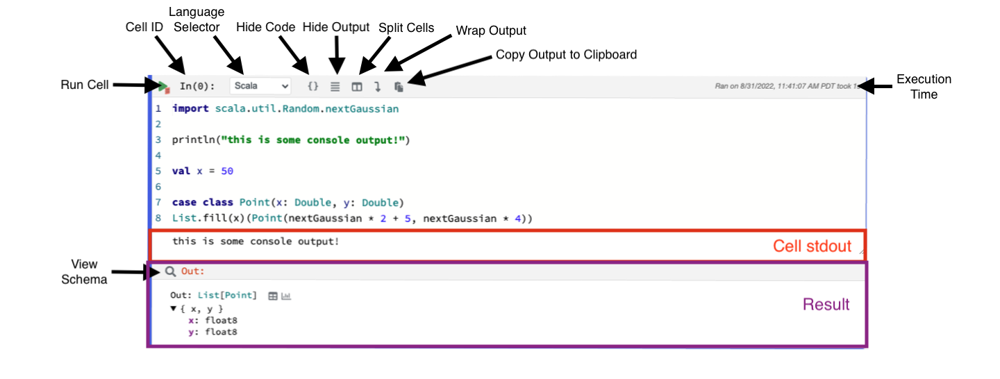

Code cells are the basic unit of a notebook interactive coding experience. 

In addition to providing a code editor, code cells show the output and results of executing the code. 



The top of a code cell has a small toolbar of cell-related functions: a button to run the cell, a drop-down for 
switching languages, buttons for hiding the code or output and a button to copy output to the clipboard (if present).

### Code Editing

Polynote provides a modern code editing experience (interactive autocomplete, error highlighting) built with the 
[Monaco Editor](https://microsoft.github.io/monaco-editor/). 

### Cell Results

The last expression in a cell is treated as its result (just as a Scala function returns the result of the last 
expression). This result is saved as the `Out` variable and is displayed in the cell's result section. 

Polynote just shows the value and simple type of simple results. For more complex results, Polynote shows a data view
that allows more inspection of the data. 

#### Nested Data

Nested data can be explored directly in a tree-like view.

=== "Exploring Nested Data"

    

=== "Source Code"

    ```scala
    case class A(foo: String)
    case class B(bar: String, a: List[A])
    case class C(quux: String, b: List[B])
    case class D(wizzle: String, c: List[C])
    case class E(wozzle: String, d: List[D])

    E(
        "wozzle",
        D(
            "wizzle",
            C(
                "quux",
                B(
                    "bar",
                    A("foo") :: A("floo") :: Nil
                ) :: Nil
            ) :: Nil
        ) :: D(
            "weasel",
            C("quacks", Nil) :: Nil
        ) :: Nil
    )
    ```

#### Inspecting Results 

Like the buttons in the [Quick Inspector](kernel-pane.md#quick-inspector), the `View Data`, `View Schema`, and 
`Plot Data` buttons each create a new [Viz Cell](visualization-and-viz-cells.md) underneath the cell. 
