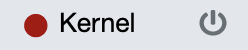
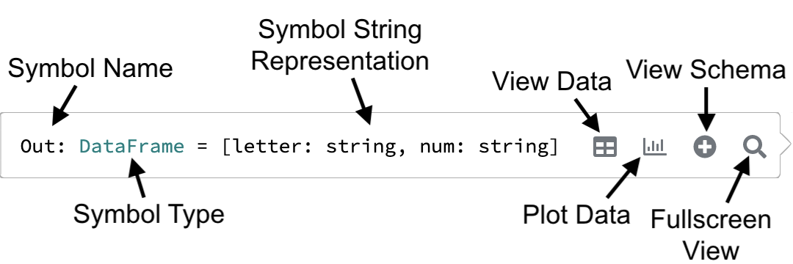

The Kernel Pane displays information about the running state of the active notebook's kernel. 

- The [Header](#header){: style="color:green"}, which shows the current status of the kernel and controls for starting 
  and stopping it. 
- The [Info](#info){: style="color:blue"} section, which shows information about the current kernel.
- The [Symbol Table](#symbol-table){: style="color:darkorange"}, which shows the state of the kernel for the 
  currently-selected cell.
- The [Tasks](#tasks){: style="color:purple"} section, which shows what the kernel is currently doing. 

### Header

The colored circle to the left of the header shows the status of the Kernel. Possible statuses are: 

| Color    | Meaning | Example |
| -------- | ------- | ------- |
| **Gray**{: style="color: gray"}   | The client is `disconnected` from Polynote^1^      |  |
| **Red**{: style="color: red"}     | The kernel is `stopped`: connected but not running |  |
| **Yellow**{: style="color: gold"} | The kernel is `busy` executing something           |  |
| **Green**{: style="color: green"} | The kernel is running and `idle`                   |  |

1. This means that the browser is unable to talk to the Polynote server. The server might be down, or there might be a
   connection issue between the browser and Polynote. 

You might have also noticed that the symbol on the right side of the header changes depending on the kernel's status. 

This symbol is a button that allows you to interact with the kernel:

| Button   | State Available | Action |
| -------- | --------------- | ------ |
|  | `stopped`      | Launch the kernel | 
|  | `busy`, `idle` | Kill the kernel |
|    | `disconnected` | Attempt to reconnect to the server |

### Info

The Info section contains information about a currently running Kernel. 

Currently, standard kernels simply display the current Polynote version, as well as the build commit. 

!!!tip 
    Use the version and commit information when [reporting issues](https://www.github.com/polynote/polynote/issues/new) 
    to the Polynote team!

In addition to the above, Spark kernels show a link to the current Spark UI. 

### Symbol Table

The Symbol Table reveals the current state of the notebook, showing the input and output symbols of the currently
selected cell (provided that the cell has been run). 

See the [Basic Usage](basic-usage.md#the-symbol-table-and-input-scope) section for a simple example of the symbol table. 

The symbol table displayes the names and types of the available symbols. In order to see the value of the symbols and to
inspect them further, you can hover over them to reveal the Quick Inspector.

#### Quick Inspector

In the above example, the selected cell has been run, so the symbols defined within are visible in the symbol table. 
Hovering over each symbol reveals the Quick Inspector. 

For the `data` variable, a simple `:::scala Seq[(String, String)]`, the Quick Inspector shows the entire `toString()` 
value. However, as `Out` is a `:::scala DataFrame`, only the schema is shown as Polynote evaluates it lazily to prevent
collecting huge data unnecessarily.

Let's take a closer look at the Quick Inspector. 

The first three buttons - `View Data`, `View Schema`, and `Plot Data`, each create a new 
[Viz Cell](visualization-and-viz-cells.md) underneath the cell that defined the symbol, with the appropriate tab selected. 

The last button, the magnifying glass, creates a modal that shows the available representations of the output.

### Tasks

The Tasks section exposes information about what the kernel is doing: current and queued executions, as well as errors 
that might come up that are not associated with a particular cell.

#### Currently Running Tasks

In the above example, a cell that contains Spark code is being executed, while the cell below it is queued up. 

On the Tasks section, the current state of the execution is shown: the top task is labeled with the currently-running 
cell's ID, as well as a label reflecting the statement being executed currently - in this case, the `sparkComputation` 
variable being computed; in other cases a line number might be shown.  

Since the execution is a Spark job, an additional task is shown, showing details of the Spark execution: the job number 
and a label for the currently-executing stage (in this case, the call to `collect()`). 

Finally, task is generated for the queued cell that will be executed after this one is finished. The tasks list
always shows the order in which cells will be executed. 

!!!tip
    Note the Stop button on the top-right corner, which can be used to stop the currently-running task. It behaves
    like the other stop buttons in the UI; for more details, please see the [advanced documentation](advanced.md#stopping). 

#### Kernel or Server-level Errors

The Tasks section also provides a location to display error messages that don't belong to a specific cell. For example, 
you might see errors encountered during dependency resolution, or kernel crashes, or connection issues. 
