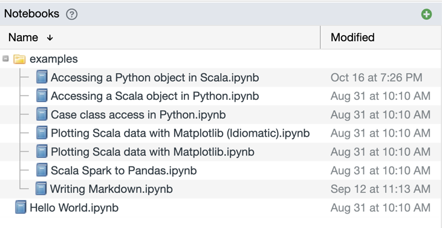
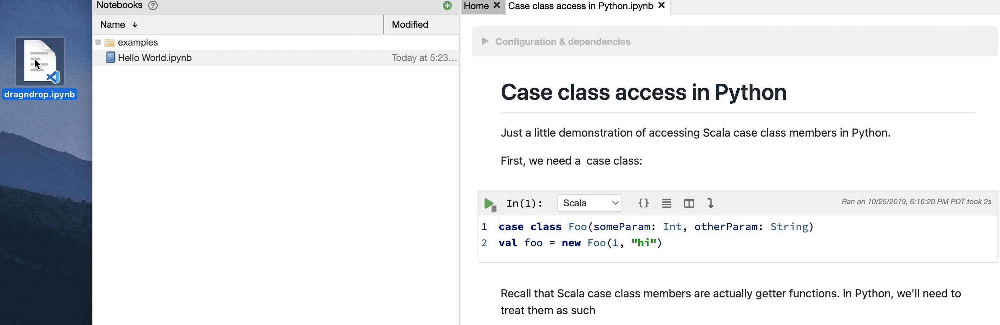
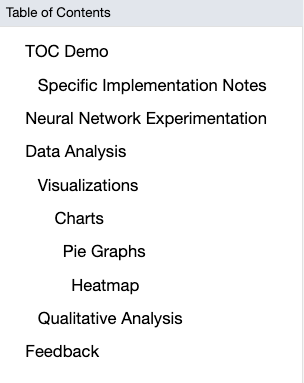
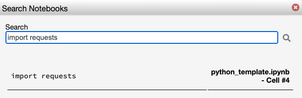

The Left Pane offers easy access to a file-like browser showing the notebooks in Polynote's workspace, a table 
of contents (called `Summary`) showing the headings in your current notebook, and a search button to search all of Polynote's notebooks. 

### The Left Bar 
The Left Bar is where you can access these three different sections. The `Notebooks` and `Summary` buttons will open the
left pane with the corresponding data (or close it, if it was already open). The `Search` button will open a modal, shown 
in the [Search Section](left-pane.md#Search)

{: .centered-image }

### Notebook List 
The Notebooks List displays a listing of all the notebooks in your current workspace.

{: .centered-image }

Notebooks are displayed in a directory structure. You can sort the list by name or modified time in ascending or
descending order by clicking the respective column header. You can change the column width by clicking and dragging on
the divider in the header bar between `Name` and `Modified`.

Clicking on a notebook opens it, and clicking on a directory expands or collapses it.

!!!tip
The current workspace can be set in the [Storage Configuration](server-configuration.md#storage).

#### Creating a new notebook

You can create a new notebook by clicking on the green plus sign
{: .inline-image} in the corner.

This will bring up the Create Notebook Dialog, where you can enter the notebook name. If a notebook with that name 
already exists, a number will be appended at the end of the filename. 

!!!tip
    Any slashes in the notebook name will place your new notebook in a directory (creating them if they don't already 
    exist). 

    If you'd like to quickly create a new notebook inside of an existing directory, right-click on any directory and select `New Notebook`. 

    Additionally, Polynote will add an extension if you don't specify one. 
    For example, typing in `foo/bar/My Notebook` will create a `My Notebook.ipynb` file and put it into a directory 
    named `bar`, within a directory named `foo`. 

#### Importing a notebook

Importing a notebook into Polynote is as simple as dragging and dropping the file onto the Notebooks List!

If you hover over and then drop your file into a sub-directory, your file will be imported into that sub-directory.

!!!info "Supported import formats"
    Polynote supports importing your existing Jupyter `.ipynb` files and Zeppelin `.json` files. Zeppelin files will be 
    automatically converted into `.ipynb` files upon import. 

    Note that Polynote doesn't do any translation of the notebook contents, so any platform-specific features, such as 
    Jupyter "magics" (like Toree's `%AddJar`) or Zeppelin's `z.load` syntax will need to be manually converted. 

#### Rename, Copy, Delete

You can Rename, Copy, and Delete notebooks using the Context Menu, which you can bring up by right-clicking on a 
notebook. 

Here's a demonstration of Renaming a notebook using the Context Menu. The Copy and Delete functions work rather 
similarly.

### Notebook Table of Contents
The Table of Contents displays a neat summary of all of the headings written in markdown in your current notebook to help 
make notebook navigation easier. 

Whenever you add a heading 1-6 (either in the RTE or markdown editor), it will automatically appear in the table of contents.
Reordering the cells will also reorder the table of contents.

Each heading is indented slightly based on the level of its heading, where `h1`s are not indented at all and 
`h6`s are indented the most. 

#### Navigating with the Table of Contents
To jump directly to a section in the Table of Contents, you can select the heading you want to navigate to in the Left Pane.

Whenever you select a cell, even if it does not have a header, it will automatically highlight the closest cell with a header
above it (if one exists) to help you better find where you currently are in a notebook. 

### Search 

You can search all of your notebooks for a line of text. This will index all of the notebooks in your mounted directories, 
returning results from both code and text cells, but not outputs. Note that this feature only supports searching for a 
single line - multi-line search is not supported. 

You will receive a scrollable list of results, which highlight the line of text returned, what file it comes from, and 
which cell. 

!!!tip 
    You can click directly on a result to jump straight to that cell (this will open the notebook if it is not already open). 

