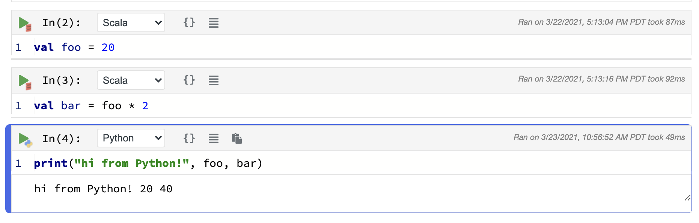
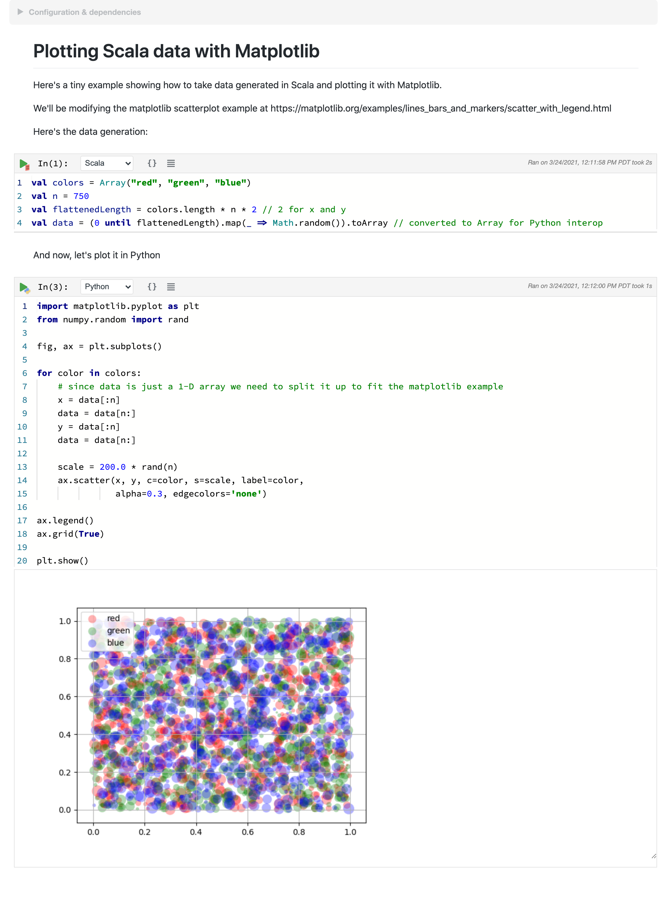
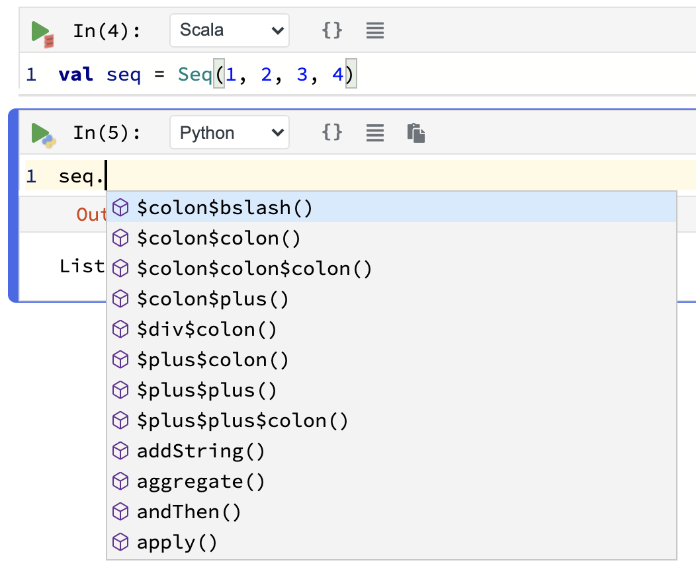

One of Polynote's most interesting features is its support for polyglot notebooks, where cells within the same notebook 
can be written in different languages.

Variables can also be shared across languages, as all execution is done within a single process. 

### Execution state in Polynote

We hinted [previously](basic-usage.md#the-symbol-table-and-input-scope) that the way Polynote handles cell execution
is a little special.

As a reminder, the kernel keeps track of all the symbols defined by a cell execution. These symbols are part
of the cell's state, which is made available to downstream cells (those below the cell in question) when they in turn
are executed.

Polynote stores these symbols, alongside their types and other information, in a Scala-based format. Symbols defined by
and provided to other languages are wrapped (and unwrapped) appropriately.

!!!info ""
    For more details, how this works under the hood, and information about its limitations and caveats, check out 
    the [Python documentation](python.md).

### Polyglot example

Continuing our example notebook from [before](basic-usage.md), here's a trivial example (note that the bottom cell has
Python selected in the language drop-down). 



The `foo` and `bar` Scala variables can be accessed directly in Python, because they represent primitive 
types (`:::scala Int`s in this case). This also works the other way 'round, from Python to Scala, in much the same way.

### Use Case: Plotting Scala data with Matplotlib

!!!tip "Real-world usage at Netflix"
    This example notebook illustrates a contrived version of a common use-case at Netflix. [Our recommendation and
    personalization infrastructure is heavily JVM-based](https://www.slideshare.net/FaisalZakariaSiddiqi/ml-infra-for-netflix-recommendations-ai-nextcon-talk),
    and Algorithm Engineers and Scientists want to interface with our platform in order to, for example:

    - [transform data in a type-safe way using Scala](https://portal.klewel.com/watch/webcast/scala-days-2019/talk/12/)
    - [access Model Lifecycle data](https://www.usenix.org/conference/opml20/presentation/cepoi)
    - [generate features based on online data snapshots](https://netflixtechblog.com/distributed-time-travel-for-feature-generation-389cccdd3907)

    Once they get the data, they'd like to analyze and visualize it using the Python tools they are familiar with, such
    as [pandas](https://pandas.pydata.org/) and [matplotlib](https://matplotlib.org/).

A more complex example of a more typical usage can be found in the `examples/` folder in 
[`Plotting Scala data with Matplotlib.ipynb`](https://github.com/polynote/polynote/blob/master/docs/examples/Plotting%20Scala%20data%20with%20Matplotlib.ipynb)
which is reproduced below. 

We'll go over this example in detail.



#### A direct approach using primitives

This notebook takes a direct approach to polyglot development. By crossing language boundaries using primitive data 
structures, you don't need to worry about the details of language-specific data structures or implementations. 

Let's go over this notebook, which consists of two cells. The first, a Scala cell, prepares some data, while the second,
a Python cell, plots it.

!!!example "Scala cell"
    ```scala
    val colors = Array("red", "green", "blue")
    val n = 750
    val flattenedLength = colors.length * n * 2 // 2 for x and y
    val data = (0 until flattenedLength).map(_ => Math.random()).toArray // converted to Array for Python interop
    ```

This cell generates an `:::scala Array[Double]` that is a flattened representation of data in three dimensions - `color`, 
`x`, and `y`. 

This data is then fed into the Python cell to be plotted: 

!!!example "Python cell"
    ```python
    import matplotlib.pyplot as plt
    from numpy.random import rand

    fig, ax = plt.subplots()

    for color in colors:
        # since data is just a 1-D array we need to split it up to fit the matplotlib example
        x = data[:n]
        data = data[n:]
        y = data[:n]
        data = data[n:]

        scale = 200.0 * rand(n)
        ax.scatter(x, y, c=color, s=scale, label=color,
                   alpha=0.3, edgecolors='none')

    ax.legend()
    ax.grid(True)

    plt.show()
    ```

This cell steps through the `data` array and, for each `color`, unflattens the `x` and `y` data for plotting (note that
both `data` and `color` are Scala variables accessed directly from Python).

#### Can we do better?

This is pretty straightforward, but you might have noticed that the interchange values between the two languages are
`:::scala Array`s, rather than the more idiomatic (for Scala) `:::scala Seq`s. You might also notice that it was pretty 
unnatural to flatten `data` like we did. 

The reason for this is that it's easier to interchange between Scala and Python using primitives and basic structures 
like Arrays. 

!!!info ""
    You might not realize it, but when you work with Scala there's all sorts of stuff going on behind the scenes, 
    such as implicits, or encoded Java method names (like `$colon$colon()`). 

    Python doesn't know about this, so when we interact with a Scala object from Python we see it in all its gory details: 

    {: width=50% }

However, with a little Scala knowledge we can rewrite the plotting code to be more idiomatic, at the expense of having 
to do (a bit) more work in Python to massage the data. 

#### A more idiomatic implementation

First, we'll use some more idiomatic code to generate our point data: 

```scala
case class Point(x: Double, y: Double, color: String)
val colors = Seq("red", "green", "blue")
val n = 750
val idiomaticData = for {
    color <- colors
    n     <- (0 to n)
} yield Point(Math.random(), Math.random(), color)
```

Wow, a `:::scala case class` AND a `:::scala for` expression? This is surely extremely idiomatic Scala code. 
Not an `:::scala Array` in sight!

Let's inspect `idiomaticData` for a moment. 


!!!info "Inspecting and Visualizing Data"
    This image showcases using the [Quick Inspector](kernel-pane.md#quick-inspector) and [Viz cells](visualization-and-viz-cells.md) 
    to easily inspect values within a notebook.

Now that we've taken a look at `idiomaticData` and seen that it's a `:::scala Seq[Point]`, we can delete the Viz cell and 
start working with it using Python. 

Since we're no longer working with primitives, we need to do a little data preparation. We'll build a `:::python list`, 
iterate over `idiomaticData`, and extract values from `Point`. 

We want to end up with a simple 2D-Array we can use with `matplotlib`. 

```python
data = []
for idx in range(0, idiomaticData.length()):
    point = idiomaticData.apply(idx)
    data.append([point.x(), point.y(), point.color()])
```

There are two things of note here. 

First, we need to manually iterate through the collection, generating an index which we can pass into the
[`:::scala apply(idx: Int): A`](https://www.scala-lang.org/api/2.12.0/scala/collection/Seq.html#apply(idx:Int):A)
method of the `Seq` to select elements from it. 

Second, we'll access the `:::scala case class` members using the member accessor methods as usual, but note that with 
Python we need to specify `()`, as in `:::python point.x()`, since of course in Python parentheses are always required, 
even for nullary functions (ones that have no arguments). 

At this point, the `data` variable is a nice `:::python list` of `:::python list`s, and we can easily turn it into a 
Pandas DataFrame: 
```python
import pandas as pd

df = pd.DataFrame(data=data, columns=['x', 'y', 'color'])
```

Note that we have to manually specify the column names here. A more advanced example might extract the fields from 
`:::scala Point` and pass them into Python, but we'll pass on that for now. 

Now that our data is a Pandas DataFrame we can manipulate it as usual. For example, we can add a `scale` column to it:

```python
import numpy as np

df['scale'] = np.random.uniform(1, 200, df.shape[0])
```

Finally, we can plot our DataFrame in the familiar way. 

```python
import matplotlib.pyplot as plt

fig, ax = plt.subplots()

groups = df.groupby("color")
for name, group in groups:
    ax.scatter(group.x, group.y, c=group.color, s=group.scale, label=name,
               alpha=0.3, edgecolors='none')

ax.legend(loc="upper right")
ax.grid(True)

plt.show()
```

That's it! This notebook can be found in the `examples/` folder as well, in
[`Plotting Scala data with Matplotlib (Idiomatic).ipynb`](https://github.com/polynote/polynote/blob/master/docs/examples/Plotting%20Scala%20data%20with%20Matplotlib%20(Idiomatic).ipynb).
You can see a screenshot below.


Next, read about [using Spark with Polynote](spark.md).