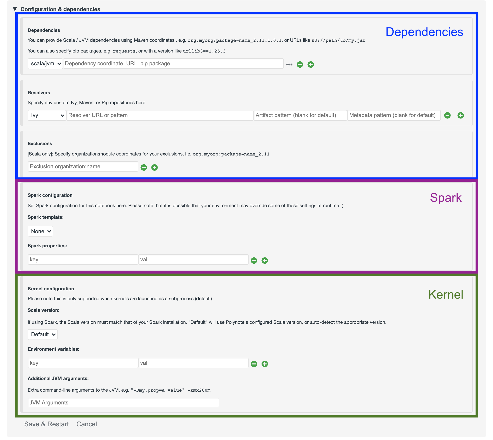
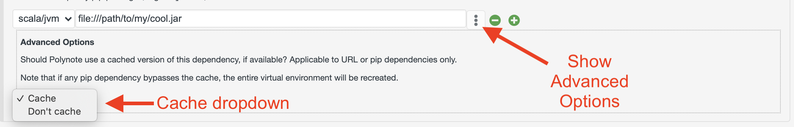

The Notebook Configuration section allows you to set metadata for this notebook's execution environment. 

The environment can be broken up into three general categories, as shown in the following diagram: 

- [Dependencies](#dependencies){: style="color: blue"}: the JVM and Python dependencies needed by your code
- [Spark Properties](#Spark){: style="color: purple"}: Spark-specific configuration
- [Kernel Configuration](#kernel){: style="color: green"}: other runtime configuration for the Kernel

### Dependencies

This section provides options for configuring dependencies that should be available when the notebook is executed.

#### JVM dependencies

JVM dependencies can be specified in the familiar 
[Group, Artifact, Version (or GAV) notation](https://maven.apache.org/guides/mini/guide-naming-conventions.html), such
as `org.http4s:http4s-core:1.0.0-M16`. 

Polynote will resolve and download this dependency, as well as its transitive dependencies, using 
[Coursier](https://get-coursier.io/). Use the Exclusions section to exclude any pesky transitive dependencies that are
causing you problems.

Use the Resolvers section to set up any custom resolvers (e.g., your company's internal resolver). Polynote supports 
both Maven and Ivy resolvers (the type of resolver can be selected in the dropdown).

Additionally, Polynote supports specifying a URL directly to a jar file - such as `file:///home/jars/myCoolLibrary.jar`. 
Supported schemas include `http` and `s3` (if Spark is enabled). 

!!!warning
    Note that if you specify a jar directly, Polynote will not resolve any transitive dependencies for this jar. In 
    general, we recommend using GAV coordinates if you can.

#### Python dependencies

Similarly, Polynote allows you to specify Python dependencies using [anything supported by pip](https://pip.pypa.io/en/stable/user_guide/#installing-packages)

This means that you can specify pip dependencies by simply naming them, (e.g., `requests`), using a version 
(`requests==2.25.1`), and even a requirement specifier (`requests>=2.25`). You can also pass in a file URL, as long as
it's supported by pip. 

You can also specify additional pip resolvers (e.g., your company's internal resolver) in the Resolvers section (select
`pip` in the dropdown). Polynote just passes the resolver into pip (using 
[`--extra-index-url`](https://pip.pypa.io/en/stable/reference/pip_install/#install-extra-index-url)), so be sure your
repository URL works with that. 

Polynote creates a virtual environment for your notebook when you specify any pip dependencies. See the [python 
documentation](python.md#python-dependencies) for more details. 

#### Dependency Caching

By default, Polynote caches JVM dependencies that are specified with URLs, as well as the [virtual environment created
for your notebook](python.md#python-dependencies). 

You can choose to manually bust the cache by unfolding the Advanced Options pane for your dependency by clicking on the 
`...` button next to it. 

Changing the cache option affects different types of dependencies differently. 

- **JVM Dependencies**
    - URL-based dependencies are affected by this setting. If using the cache, Polynote uses the cached file (if 
      present) instead of downloading it again. Conversely, if the cache is disabled for this dependency then Polynote 
      will download the jar anew each time.
    - GAV notation dependencies are unaffected by this change (Coursier caches these dependencies itself and we don't
      expose any way to change that for now)
- **Python Dependencies**
    - Python dependencies are affected by this setting. Since they share a virtual environment for this notebook, 
      **bypassing the cache for any Python dependency will bust the cache for all Python dependencies**, since this is 
      implmemented as a simple deletion and recreation of the virtual environment. 
      
!!!question "Feedback requested"
    If these restrictions are inconvenient for you, please let us know and we can look into improving this feature. 

### Spark

There are two complementary ways to specify Spark properties. 

- `Spark Templates` are sets of related configuration that can be defined in the [Server Configuration](configuration.md#spark)
- `Spark Properties` are key-value pairs that Polynote will insert into the Spark configuration. 

For more details on using Spark with Polynote, check out the [Spark documentation](spark.md)

### Kernel

The Kernel configuration contains some miscellaneous configuration that affect the runtime environment of the Kernel. 

First, the **Scala version** can be set (independently of the version running on the server). Currently, only 2.11 and
2.12 are supported (since those are the versions supported by Spark). 

!!!warning
    The Scala version you select must match that of your Spark installation. If you're unsure what that is, just leave 
    it as `Default` and Polynote will take care of it for you!

In the second section, you can also add **Environment Variables** that will be made available to the Kernel process. 

Finally, in the last section you can add any additional **JVM Arguments** that Polynote will set when it launches the 
Kernel process. 