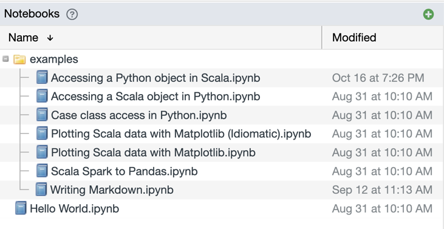
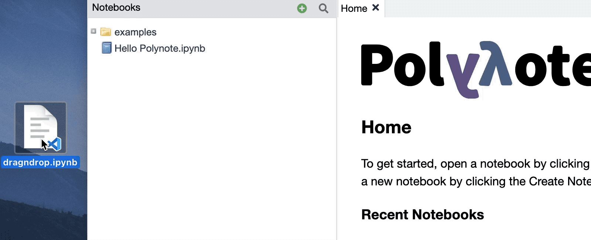

The Notebooks List displays a listing of all the notebooks in your current workspace. 

{: .centered-image }

Notebooks are displayed in a directory structure. 

Clicking on a notebook opens it, and clicking on a directory expands or collapses it. 

!!!tip
    The current workspace can be set in the [Storage Configuration](server-configuration.md#storage).

### Creating a new notebook

You can create a new notebook by clicking on the green plus sign
{: .inline-image} in the corner.

This will bring up the Create Notebook Dialog, where you can enter the notebook name. If a notebook with that name 
already exists, a number will be appended at the end of the filename. 

!!!tip
    Any slashes in the notebook name will place your new notebook in a directory (creating them if they don't already 
    exist). 

    Addiitonally, Polynote will add an extension if you don't specify one. 

    For example, typing in `foo/bar/My Notebook` will create a `My Notebook.ipynb` file and put it into a directory 
    named `bar`, within a directory named `foo`. 

### Importing a notebook 

Importing a notebook into Polynote is as simple as dragging and dropping the file onto the Notebooks List!

!!!info "Supported import formats"
    Polynote supports importing your existing Jupyter `.ipynb` files and Zeppelin `.json` files. Zeppelin files will be 
    automatically converted into `.ipynb` files upon import. 

    Note that Polynote doesn't do any translation of the notebook contents, so any platform-specific features, such as 
    Jupyter "magics" (like Toree's `%AddJar`) or Zeppelin's `z.load` syntax will need to be manually converted. 

### Rename, Copy, Delete

You can Rename, Copy, and Delete notebooks using the Context Menu, which you can bring up by right-clicking on a 
notebook. 

Here's a demonstration of Renaming a notebook using the Context Menu. The Copy and Delete functions work rather 
similarly.

