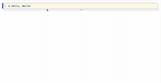

Text Cells provide you the option of a Rich Text Editing or a traditional markdown editing experience.  

### Rich Text Editing 
Rich Text Editing allows you to edit and format text as you type it, like editing a document.  

The [Text Toolbar](toolbar.md#text-cells) contains standard Rich Text Editing elements: 

- Text style (Heading, Paragraph, etc.)
- Emphasis (bold, italic, underline, strikethrough)
- List (unordered, ordered)
- Indentation

It also contains a few non-Standard options.

#### Code and Links

The **code** button tags the currently-selected text as `code`, formatting it as monospaced. 

The **link** button tags the currently-selected text as a link. Clinking on a link will reveal the URL in a tooltip, 
allowing you to navigate to the website. 

{: .centered-image }

#### LaTeX Editor

You can also input `LaTeX` into your text cells, using the button that looks like a Sigma. 

{: .centered-image }

### Markdown Editing 
The Markdown Editor allows you to edit your text directly as markdown in a code editor and see it rendered as 
traditional compiled markdown. 

To enable markdown editing in place of traditional Rich Text Editing, set the `markdown` setting to `true` in 
the [About menu](about-menu.md). 

To view an example of markdown in Polynote, see the example notebook on
[Writing Markdown](https://github.com/polynote/polynote/blob/master/docs-site/docs/docs/examples/Writing%20Markdown.ipynb).

{: .centered-image }