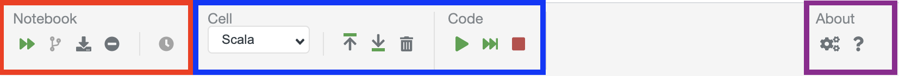
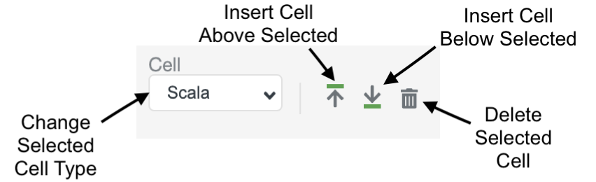

The toolbar is one of the primary ways you'll be interacting with Polynote. 

It is divided into sections, which we will go over now. 

The toolbar is divided into three sections: [Notebook](#notebook-section){: style="color: red" }, 
[Cell](#cell-section){: style="color: blue" } and [About](#about-section){: style="color: purple" }. 

### Notebook section

This section contains buttons that interact with the currently active notebook. The three relevant buttons are:

- The Run All button {: .inline-image } which queues up all cells of the current notebook
to run in order.
- The Download button {: .inline-image } which downloads the current notebook as 
an ipynb file. 
- The Clear Output button {: .inline-image } which clears the output of all notebook cells. 

The other two buttons are placeholders for future functionality that are currently not in use. 

### Cell section

This section contains elements for interacting with the currently active cell. 

This section has two subsections. On the left is the Cell section, which holds elements for interacting with the 
current cell regardless of its type. On the right is the a cell detail section, which changes depending on whether the
currently active cell is a Code or Text cell. 

We'll start with the invariant Cell section first. 

- The Cell Type dropdown is used to change the type of the cell. This is equivalent to the dropdown found on 
  [Code cells](code-cells.md) but it can also convert a cell from `Code` to `Text` and vice-versa.
- The Insert Cell Above {: .inline-image } and Below 
  {: .inline-image } buttons, which insert a new cell above or
  below the currently selected cell.
- The Delete Cell button {: .inline-image } which deletes the currently
  selected cell.

#### Code Cells

- The run cell button {: .inline-image } runs the currently selected cell. 
- The next button {: .inline-image } runs all 
  cells above the currently selected cell until (and including) the currently selected cell.
- The stop button { .inline-image } cancels any currently-running 
  execution (not limited to the current cell). See the [advanced section](advanced.md#stopping) to learn more about how
  stopping works.

#### Text Cells

The Text cell subsection contains the typical rich text editor interaction elements, along with a few special ones.

For more details, see the [Text Cell](text-cells.md) documentation. 

### About section

{: .centered-image }

Finally, the About section at the top-right corner contains buttons to access the [About menu](about-menu.md).