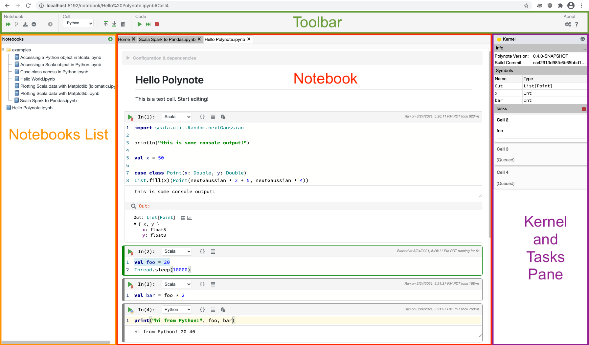
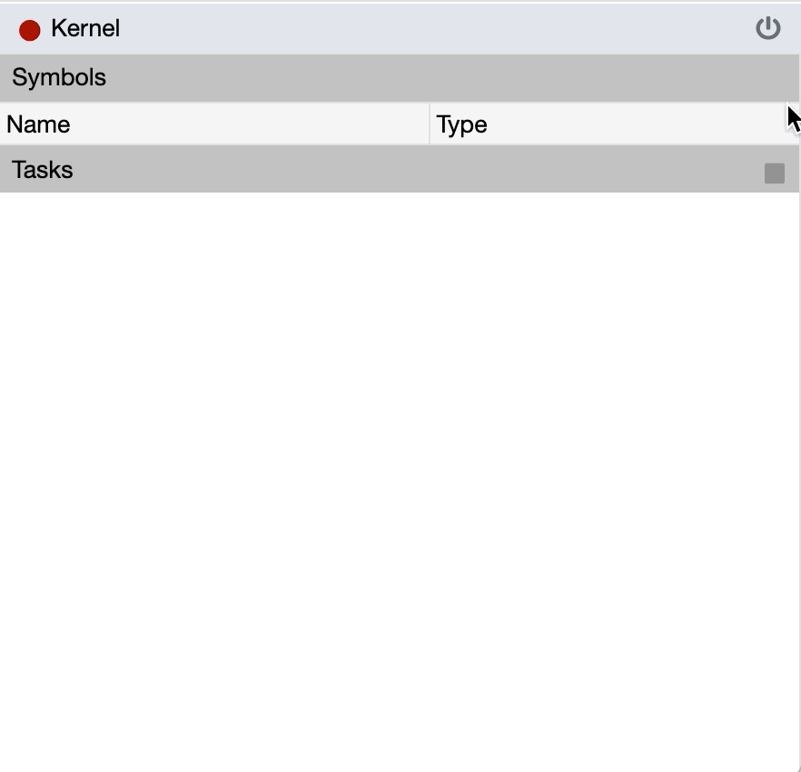

Welcome to the tour of Polynote's UI! 

Polynote takes its inspiration from IDE-like tools, bringing a rich UI into the notebook experience. 

### The Polynote UI

Here, we'll go overthe various parts of the UI briefly, and then drill down on each later in the tour. 

This screenshot divides the UI into four sections: 

- The [Toolbar](toolbar.md){: style="color:green"} at the top, which collects buttons for interaction with the notebook
- The [Notebooks List](notebooks-list.md){: style="color:darkorange"} pane on the left, a file-like browser showing the 
  notebooks in Polynote's workspace
- The [Kernel Pane](kernel-pane.md){: style="color:purple"} on the right, which shows the current state of the notebook. 
- The [Notebook](notebook.md){: style="color:red"} section itself in the middle, which displays the actual notebook. 

The above sections provide details about the specific functionality of each part of the UI. 

### Panes in Polynote

Before you go learn more about the specifics, let's just talk about how the two panes work.

#### Panes can be collapsed

If you'd like more horizontal space to see the [Notebook](notebook.md) section, you can collapse one or both of the
panes. 

Simply click on any empty space on the header, and the pane will collapse to the side. Click the title of the header
(for example, `Kernel` if you have collapsed the [Kernel Pane](kernel-pane.md)) in order to expand the pane again. 

{: width=50% }

#### Panes can be resized

If you want more room for the [Notebook](notebook.md) but don't want to hide a pane entirely, you can resize a pane by
dragging it.

!!!tip
    Polynote remembers your pane collapse and size preferences in your browser's local storage. 

    As long as you're using Polynote with the same browser, your customizations should be persisted!

Next up, learn about the [Toolbar](toolbar.md).