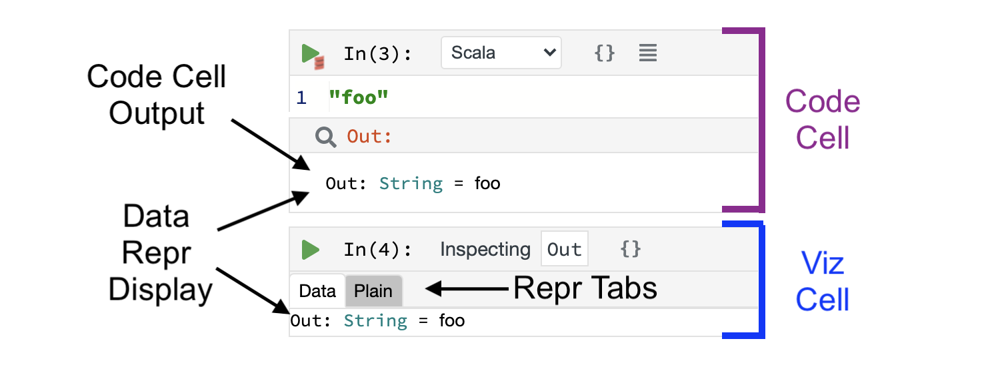
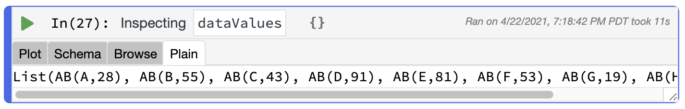

Polynote supports a number of different ways to visualize data. 

### Data Reprs

All symbols in a Polynote notebook have one or more Reprs, short for "Representations", that Polynote generates and then
sends to the frontend. 

They range from simple (such as the symbol's `toString()` value), to the complex (such as a streaming view into a Spark
`DataFrame`). 

Reprs form the building blocks for all of Polynote's native data visualization. They can be viewed in a number of 
different ways. For example, as [the result of a Code Cell](code-cells.md#cell-results), or in a [Viz cell](#viz-cells). 

Let's take a look at a simple example: the Reprs generated for a `:::scala String`. We'll show them in both a Code Cell
result as well as a Viz Cell. 



As the result of a Code Cell, the `:::scala String` is being stored in the `Out` symbol. Polynote generates two Reprs 
for a `:::scala String`. First, all symbols get a `StringRepr`, which just corresponds to its `toString()` output. 

Additionally, most symbols have some sort of representation of the symbol's type and value, such as a `DataRepr` in this
case, which carries the symbol's type as well as a serialized representation of symbol's entire value. 

In this case, `Out`'s `DataRepr` is seen both in the output of Cell 3, and in the "Data" tab of the Viz cell. In this
case, since `Out` is a simple `:::scala String`, its `DataRepr` displays its value in its entirety.

Clicking on the "Plain" tab of the Viz cell would display `Out`'s `StringRepr`, which is, of course, simply `:::scala "foo"`.

!!!info "Repr display priority"
    When there are multiple Reprs available, Polynote tries to choose the richest available Repr as the default one
    to display. In this case, the `DataRepr` is clearly richer than the `StringRepr`, which is why it's shown in the
    Code cell output and displayed by default in the Viz cell.

### Visualization Cell Types

While Code Cells do show some handy [visualization of results](code-cells.md#cell-results), for plotting or as permanent
fixtures of a notebook, it makes sense to break out the visualization of a specific value into its own cell. 

Polynote provides native [Vega](https://vega.github.io/vega-lite/) support for plotting data. A Vega spec can be 
rendered using a Code Cell, by changing its language to "Vega spec". Additionally, Viz Cells provide a Plot Editor
for supported data types. 

We'll start by discussing Polynote's Vega support. 

#### Vega Cells

Vega Cells are merely Code Cells with `Vega spec` set as the language. 

As an example, here's the "Simple Bar Chart" example 
[from the Vega-Lite Docs](https://vega.github.io/vega-lite/examples/bar.html) in Polynote.


Note that the data in this chart is stored under `values` in the `data` field of the spec itself. That's not terribly
useful: most of the time, you'll want to reference data defined in variables in your notebook.

Luckily, Polynote supports that! Let's rewrite the Vega example but this time we'll have it reference data defined in 
Scala. 

First, we'll grab the data from the example and turn it into a Scala cell:

```scala
case class AB(a: String, b: Int)
val dataValues = Seq(
    AB("A", 28), 
    AB("B", 55), 
    AB("C", 43),
    AB("D", 91), 
    AB("E", 81), 
    AB("F", 53),
    AB("G", 19), 
    AB("H", 87), 
    AB("I", 52)
)
```

Now, we can reference `:::scala dataValues` in our code.

```json
{
  "$schema": "https://vega.github.io/schema/vega-lite/v4.json",
  "title": "dataValues",
  "data": {
    "name": "dataValues",
    "values": dataValues.aggregate(["a"], [{"b":"mean"}])
  },
  "mark": {
    "type": "bar",
    "tooltip": {
      "content": "data"
    }
  },
  "encoding": {
    "x": { "field": "a", "type": "nominal", "axis": {}},
    "y": { "field": "mean(b)", "type": "quantitative", "axis": {}}
  }
}
```
In order to transform the Scala code into something that Vega can handle, we call `aggregate` on the collection which
collects the values into a format that Vega can understand.

**TODO: why "mean"?**

Remembering the aggregation syntax can be tricky, which is why we recommend using the [Plot Editor in a Viz Cell](#plot).

#### Viz Cells

Viz cells are a type of cell specifically geared towards, well, visualization. A Viz cell inspects the Reprs of a single
symbol defined in the notebook, and provides ways to visualize it.

You can create a new Viz cell by clicking on a Code Cell [inspection button](code-cells.md#inspecting-results) (which
will create a new Viz cell inspecting the `Out` result of the cell), or through the 
[Quick Inspector](kernel-pane.md#quick-inspector) (which will create a new Viz cell inspecting the current symbol). 

!!!tip ""
    Like other cells, a Viz cell can only inspect symbols that are in its scope, that is, defined in a cell above it. 

We already saw a simple Viz cell [above](#data-reprs), so let's take a look at a more interesting example: the 
`dataValues` shown [earlier](#vega-cells). 

!!!example ""
    As a reminder, `dataValues` is a collection of type `:::scala Seq[AB]`, where `AB` is 
    `:::scala case class AB(a: String, b: Int)`.  

This time, we'll start with the "Plain" tab of the Viz cell, which shows the `StringRepr` as mentioned above (you might
recognize this output as the result of calling `toString()` on a Scala `:::scala List`).



Notice that this Viz Cell has no "Data" tab. Instead, there are three tabs we haven't seen before: "Plot", "Schema", 
and "Browse".

These new tabs are actually all generated from the same Repr! Since `dataValues` is a collection, Polynote generates a 
`StreamingDataRepr` for it, which is a special type of `DataRepr` specifically meant for collections. 

!!!info "More about `StreamingDataRepr`"
    Unlike `DataRepr`, `StreamingDataRepr` is a lazy representation of the data. This means that when a 
    `StreamingDataRepr` is sent to the frontend, the data stored in the value remains in the kernel and can be streamed
    to the frontend in batches. 

    This is particularly useful when dealing with potentially huge datasets, like Spark `DataFrame`s, which are 
    streams themselves. 

Let's take a look at the three new tabs, which show different aspects of the `StreamingDataRepr` of `dataValues`.  

##### Schema

The Schema view shows the types of the entries in the collection. In this case, the fields of `:::scala AB` are a
`:::scala a: String` and `:::scala b: Int`, shown below in a struct-like display. 


Nested schemas can also be expanded, like [nested data in a Code Cell's output](code-cells.md#nested-data).

##### Browse

The Browse view provides a tabular view of `dataValues`. As the data is streamed to the browser, you'll need to page
through it to see any values, as shown below.


The example data all fits in the first page, but larger data can be paged back and forth as needed. 

!!!warning ""
    Note that paging through the data may potentially start non-trivial computations in some cases (e.g., with a Spark 
    `DataFrame`)

##### Plot

The Plot view is the most complex part of a Viz Cell. It contains a Plot Editor which generates a Vega plot in a more 
straightforward manner, allowing customization of the plot type, selection of Dimensions and Measures to plot, and more
without the need to edit Vega code directly. 

The example below shows the Plot Editor being used to generate the example graph shown in the 
[Vega Cell documentation above](#vega-cells). 


To extract the Vega spec generated by the editor, click on the {: .inline-image } to 
generate a [Vega Cell](#vega-cells) that contains the generated spec. 

### Other ways to visualize

If the Reprs that Polynote automatically generates aren't enough, there are plenty of other ways to hook into Polynote's 
display capabilities. 

#### Defining your own Reprs

If you'd like to add display capabilities to types in your code, you can implement your own Reprs by extending the
[`ReprsOf`](https://github.com/polynote/polynote/blob/master/polynote-runtime/src/main/scala/polynote/runtime/ReprsOf.scala)
trait. 

This allows you to register Reprs for your types. The easiest way to create a new Repr is to use a `MIMERepr`, which 
takes a MIME type and content string. For example, you to display some HTML you could return 
`:::scala MIMERepr("text/html", "<h1>Heading</h1>")`, or to show an image you could return 
`:::scala MIMERepr("image/png", "<a base64 encoding of a PNG>")`. 

Here's an example adding a simple HTML `MIMERepr` for the results of type `MyThing`.

**DOESN'T WORK!**

```scala
import polynote.runtime._

case class MyThing(a: String)
object MyThing {
    implicit object MyThingRepr extends ReprsOf[MyThing3]{
        override def apply(value: MyThing): Array[ValueRepr] = 
            Array(MIMERepr("text/html", s"<strong>${value.a}</strong>"))
    }
}

MyThing("hi")
```

#### Using `kernel.display`

Let's say you just want to display some output, but you don't want to go through the trouble of defining a special Repr.

You can use the `kernel.display` package (available in `polynote.runtime`) to hook into Polynote's display mechanism. 

To display an HTML string, use `:::scala kernel.display.html(content: String)`, which takes in a `:::scala String` and 
outputs it as HTML. 

You can also display other MIME types using `:::scala kernel.display.content(mimeType: String, content: String)`, where
`content` is a `:::scala String` representation of the content (e.g., base64 encoded for an image). In fact, 
`kernel.display.html` is actually a shortcut for `:::scala kernel.display.content("text/html", _)`. 

#### Visualization with Python

The Python ecosystem has a rich history of notebook usage with Jupyter/IPython, and many Python libraries define 
[rich display representations](https://ipython.readthedocs.io/en/stable/config/integrating.html#integrating-rich-display)
for use in a notebook environment. 

Polynote supports these `_repr_*_()` methods, too! Polynote simply translates these methods into their corresponding 
`MIMERepr`.


Polynote supports all of the `_repr_*_()` standard methods, including `_repr_mimebundle_()`. This means that the 
[`IPython.display` API](https://ipython.readthedocs.io/en/stable/api/generated/IPython.display.html#IPython.display.display)
also works in Polynote. 


Additionally, Polynote understands `:::python pandas.DataFrame`s and generates `StreamingDataRepr`s for them, just like
it does for Spark. 


Finally, as shown in [the tour](mixing-programming-languages.md#use-case-plotting-scala-data-with-matplotlib), Polynote 
supports `matplotlib`, too!

*[Repr]: Representation of a value for display in the notebook
*[Reprs]: Representation of a value for display in the notebook
