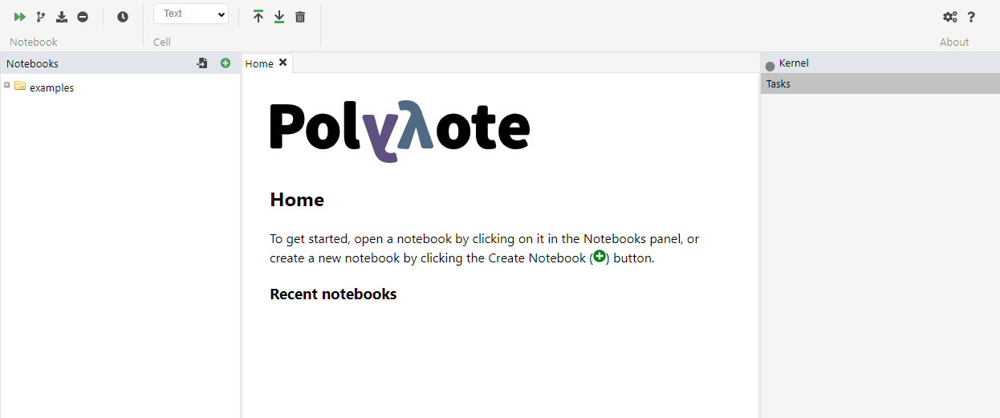
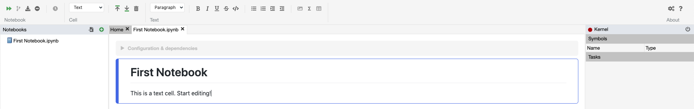
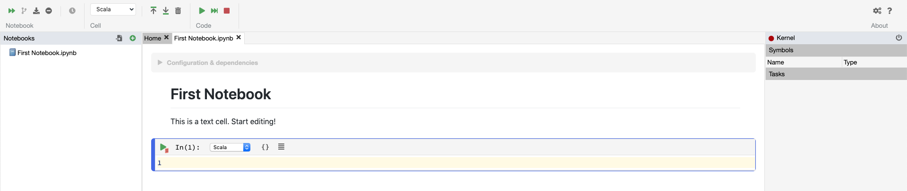
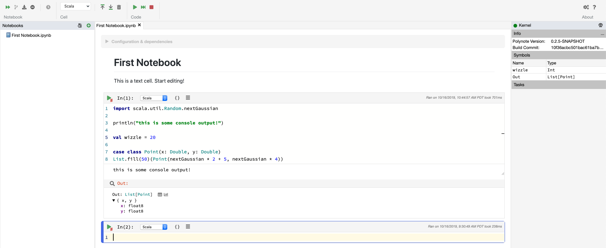
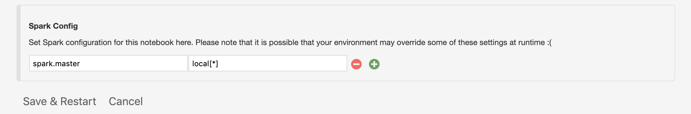

# Basic usage

After starting Polynote and opening the application in your browser, you'll see the main interface:



On the left is the list of notebook files. If you have just installed Polynote, the only notebooks you will have access to are our examples. Feel free to browse these notebooks for your future reference. You can also import
existing Jupyter notebooks into Polynote – simply drag-and-drop the notebook file from your computer onto the Notebooks
panel.

For now, though, let's just create a new notebook. Click the "New notebook" icon as the home screen instructs, and enter a name
(such as "First Notebook"). Click "OK". The new notebook appears in the Notebooks pane, and is opened in a Polynote
tab. The new notebook contains a single text cell. Click on that and you'll see the text editing toolbar appear:



This contextual toolbar appears when it's useful – when editing a text cell. A notebook is made up of text cells and
code cells; text cells are useful for writing rich text explanations, and code cells are what actually get run. Play
around with the text formatting tools for a bit, and then we'll create a new cell by pressing `Shift`{:.key}-`Enter`{:.key}.
The new cell is a code cell, with its language (by default) set to Scala:



You can change the language with the dropdown – there's one right above the cell and one on the main toolbar. If you
wanted another text cell instead, you can change it to Text as well (but only in the dropdown on the main toolbar) and
it will turn into a text cell.

Let's enter some Scala code in the code cell. Once you start typing, you'll see some activity on the right as the Kernel
is started. The Kernel is what handles the code cells. Once it starts, you'll start seeing interactive completions
as you type code. Run the code cell by pressing `Shift`{:.key}-`Enter`{:.key}. The cell runs, and output is displayed:



We can see that a few things happened after running the code:

- The console output from the `println` statement appeared in an area below the cell.
- The variable `wizzle` defined in the cell appeared in the symbol table on the right.
- The final expression of the cell was bound to a variable called `Out`, and some information about it appeared below
  the console output.

Because the expression `List.fill(50)(Point(nextGaussian * 2 + 5, nextGaussian * 4))` results in "table-like" data –
a collection of structured values – there is a special representation of it displayed. We see its "schema" (the fields
of the structured "row"), along with its type and some icons. These icons bring up the inspection window, to either
browse or plot the data (we'll go into more detail about this, but try playing with it if you like). In addition to
inspecting the "result" of the cell, any other value that's been bound to a variable can be inspected by clicking it in
the symbol table.

## The symbol table and input scope

If you create and run some more code cells, you'll notice that the symbol table changes depending on which cell is
currently focused. It shows you any values that resulted from the current cell above a thick black line, and any values
that are available to the cell (from previous cells) below the thick black line.

Polynote is different from other notebook tools in that a cell's place in the notebook is important. Every cell has an
"input state" defined by the cells that have run above it. This means that if we create a code cell that defines a value:

```scala
val foo = 20
```

Then another cell below it can use the value `foo`:

```scala
val bar = foo * 2
```

But, if we then go back and edit the first cell like this:

```scala
val foo = 20
val fail = bar * 2
```

It won't work! The value `bar` isn't in the input scope of the first cell, because it was defined in the second cell.
This is very different from how other notebook tools operate; they just have one global state that every cell mutates.
In Polynote, the input state of a cell is defined completely by which cells are above it. This is a powerful way to
enforce *reproducibility* in a notebook; it is far more likely that you'll be able to re-run the notebook from top to
bottom if later cells can't affect earlier cells.

## Using Spark with Polynote 

Polynote has deep integration with [Apache Spark](https://spark.apache.org). However, it can also run without Spark support enabled. 
In fact, since launching a Spark session can be expensive, Polynote runs your notebooks without Spark support by default. 

Polynote attempts to be smart about whether to launch a notebook with Spark: it'll only launch a Spark session if you 
have any Spark configuration parameters in the notebook config. So the fastest way to get started with Spark is to add
something like `spark.master: local[*]` to your notebook configuration, like so: 



Next, read about [mixing programming languages](03-mixing-programming-languages.md).
